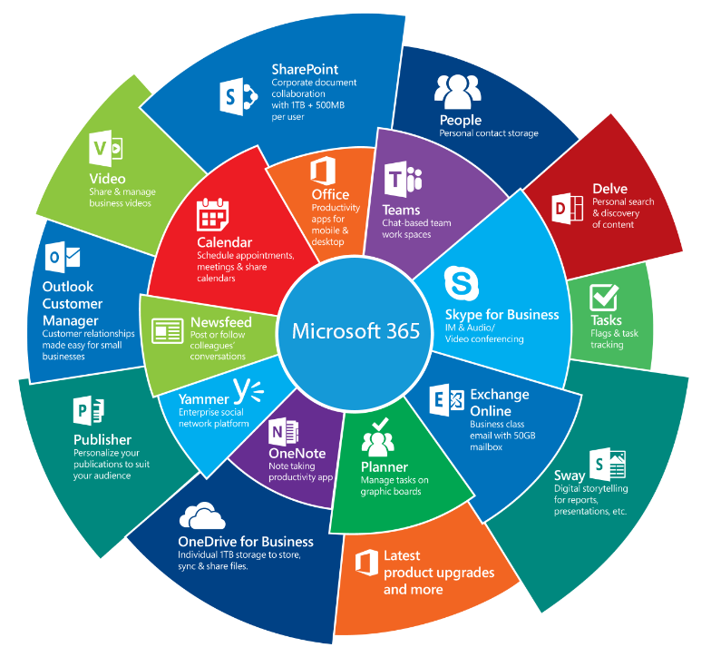
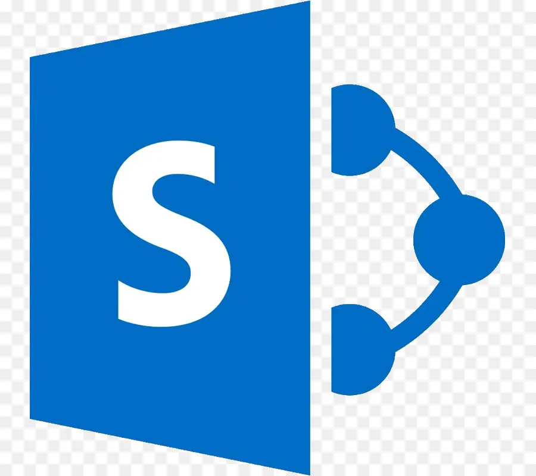
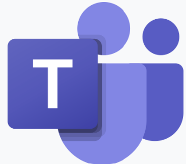
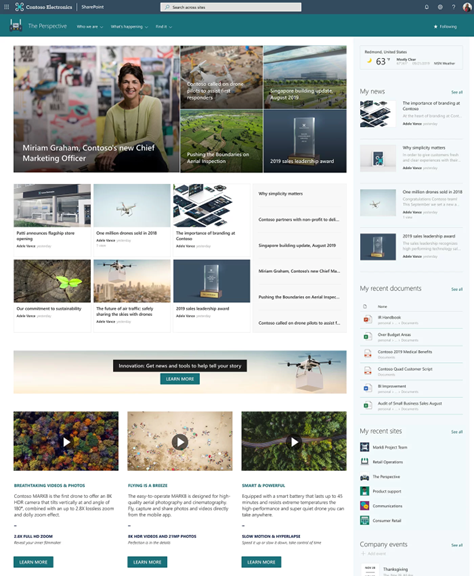
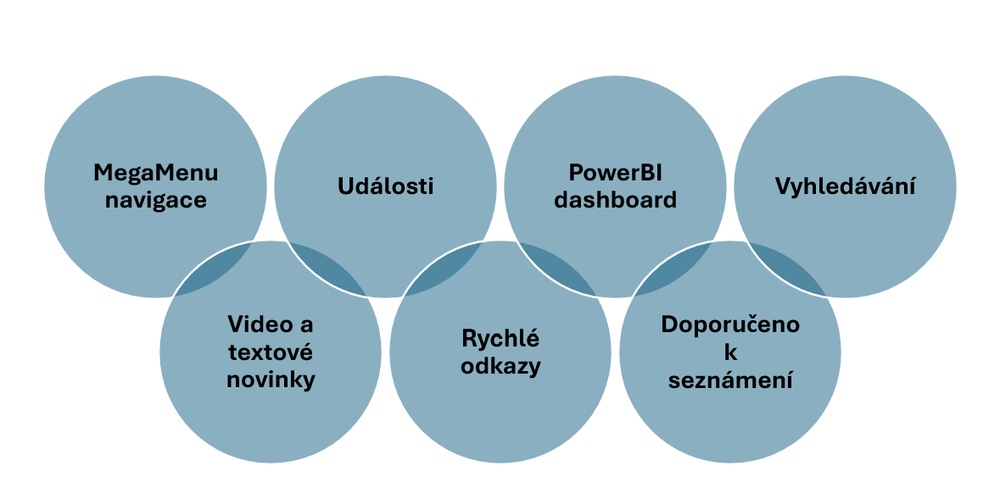
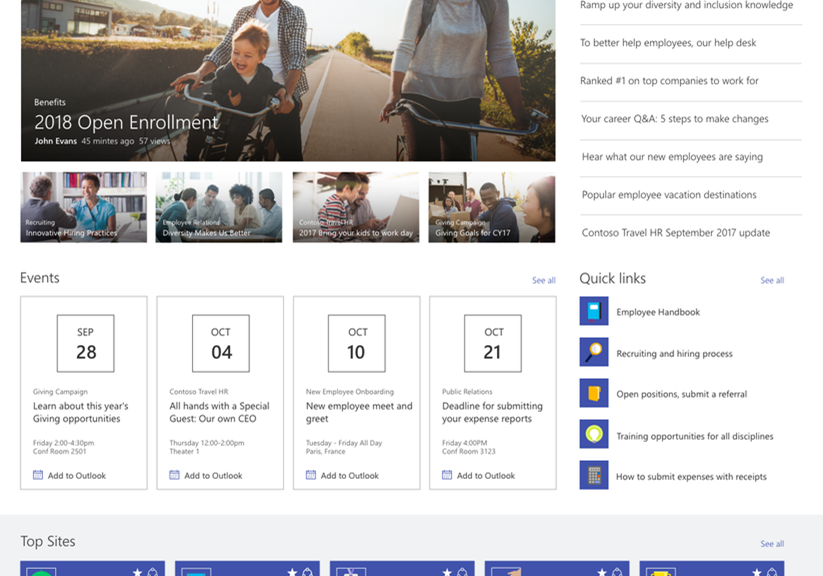
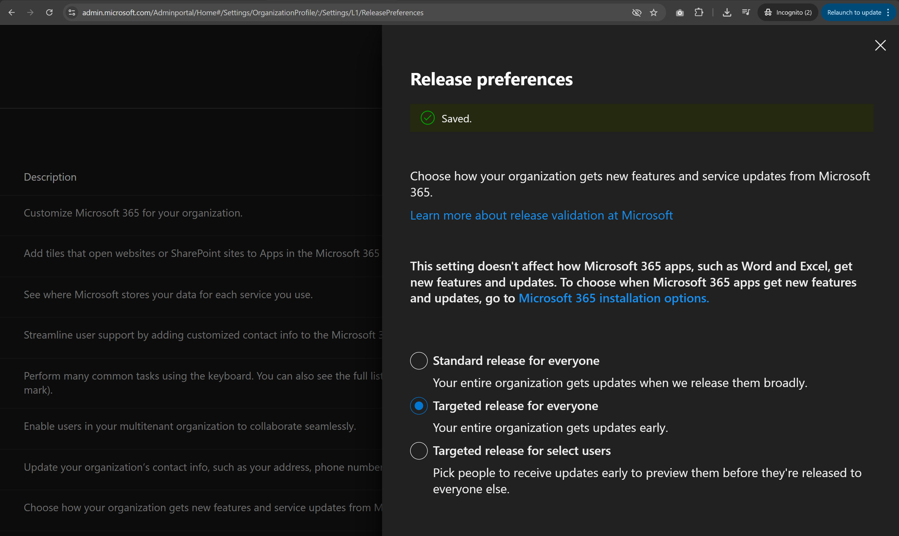

# Kapitola 01 – Představení Microsoft SharePoint

> **Bottom line.** What SharePoint Online actually is from an admin's chair — its role, editions, the key differences from SharePoint Server, and why governance is a day-one concern, not an afterthought.
>
> **Ve zkratce.** Co je SharePoint Online z pohledu správce – jeho role, edice, klíčové rozdíly oproti SharePoint Serveru a proč je governance věc prvního dne, ne dodatečná záležitost.

Pozicování produktu, klíčové scénáře využití, edice, rozdíly oproti SharePoint Serveru z pohledu správce a přehled SharePoint Governance.

## Pozicování produktu a klíčové scénáře využití

SharePoint není samostatný produkt – je to jedna ze služeb **Microsoftu 365**, těsně provázaná s Teams, Exchange, OneDrive, Entra ID a Power Platform. Z pohledu správce je klíčové vnímat ho v tomto kontextu: většina scénářů kombinuje SharePoint s dalšími službami.

SharePoint, Microsoft Entra ID a Microsoft Teams patří mezi nejčastěji propojené služby, se kterými SharePoint scénáře pracují:

## Scénáře SharePoint Online

### ECM – správa podnikového obsahu

- **Webový obsah** – stránky webů, novinky.
- **Dokumenty** – standardizace obsahu (šablony, metadata, životní cyklus).
- **Textový obsah** – textová řádková evidence čehokoli v rámci seznamů.
- **Multimediální obsah** – obrázky, videa.
- **Znalostní centra (centra životních situací)** – sady SharePoint stránek plus dokumentů.

### Teams – SharePoint integrace

- Site pro týmy.
- Site pro privátní kanály (3 typy).

### Podnikové aplikace (Power Platform)

Automatizace a tvorba řešení nad SharePointem: **Power Automate**, **Power Apps**, **Power BI**, **Power Pages**, **Power Virtual Agents**.

### Typické scénáře nasazení

- **Informační hub (company home)** – stránky webů typu novinky, textové „krátké zprávy" a videonovinky, s cílením na konkrétní skupiny uživatelů.

  

- **Content Management a Records Management** – správa obsahu a záznamů.

- **Znalostní centra** – textové informace, dokumenty a multimediální obsah cílený pro konkrétní skupiny uživatelů.

  

- **Multimediální centra** – obrazový, audio a video obsah s možností „chytrého" streamování.

  

## SharePoint Online edice

Aktuální plány a jejich porovnání:

- [SharePoint / Microsoft 365 plány a ceny](https://www.microsoft.com/en-us/microsoft-365/business/microsoft-365-plans-and-pricing)
- Porovnání plánů Microsoft 365 Enterprise
- Microsoft SharePoint Premium – SharePoint Advanced Management

## Rozdíly oproti SharePoint Serveru z pohledu správce

| Oblast | SharePoint Online | SharePoint Server SE |
|---|---|---|
| Správa infrastruktury | Microsoft zajišťuje správu serverů, údržbu a aktualizace (plně hostovaná služba v cloudu) | Správce je zodpovědný za veškerou správu fyzické infrastruktury (servery, virtualizace, síť, aktualizace, zálohování) |
| Aktualizace a nové funkce | Automatické aktualizace, přístup k nejnovějším funkcím bez zásahu správce | Správce instaluje aktualizace ručně; nové funkce přicházejí později než v cloudu |
| Škálovatelnost | Automatická, zdroje poskytuje Microsoft | Vyžaduje správu hardwarových a softwarových zdrojů firmy |
| Zálohování a obnova | Microsoft se stará o zálohy; obnova z koše a přes verzování | Správce zajišťuje zálohy a obnovovací procesy ručně |
| Zabezpečení a shoda | Řeší Microsoft na úrovni služby | Správce zajišťuje ve vlastní infrastruktuře |
| Integrace se službami MS | Snadná integrace s Microsoft 365 (Teams, OneDrive, Power Automate, Power Apps) | Omezenější, vyžaduje další konfiguraci |
| Licencování a náklady | SaaS – měsíční poplatek za uživatele | Jednorázová platba za serverové licence + CAL licence + náklady na hardware |
| Přístup odkudkoli | Globální přístup s internetovým připojením | Omezený na firemní síť, není-li nastaven vzdálený přístup / VPN |
| Vyhledávání | Cloudové, automaticky škálovatelné | Musí být spravováno a nastaveno ručně |
| Hybridní scénáře | Plná podpora propojení Online a on-premises | – |

> **Tip k diagnostice:** `Correlation ID` je identifikátor, který posíláte do Microsoft Supportu. Nemá smysl ho googlit – slouží jen jako reference pro podporu.

### SharePoint Online a naplánované úlohy (Timer Jobs)

Vše, co v SharePoint Online běží z pohledu služeb, se vykonává v kontextu **naplánovaných úloh (Timer Jobs)**. Praktický důsledek pro správce:

- Chcete zpřístupnit připravenou šablonu dokumentu na všech webech (globální content type)? Počkáte si někdy i dny.
- Chcete mít všude nová spravovaná metadata (global term store term)? Opět si počkáte.

Každý timer job má definovanou frekvenci spuštění, kterou nemůžete ovlivnit ani nevidíte auditní log jeho běhu.

## SharePoint Governance – jak z platformy vytěžit maximum

**SharePoint musí být řízené prostředí.**

**SharePoint Online Governance** je sada zásad, pravidel a postupů definujících principy správy SharePoint Online a využití jednotlivých funkcí. Díky správně nastavené a do praxe zavedené governance získává organizace vysoký standard služeb, jistotu správnosti technických postupů, dlouhodobou udržitelnost a soulad.

Governance se definuje formou samostatných předpisů – dokumentů řešících vždy jednu konkrétní oblast. Následující rámec má **27 kapitol** v šesti oblastech:

**Readiness**
- SharePoint Training

**Ongoing Support**
- Ongoing Support Scope
- Level of support provided by internal IT
- Level of support provided by SharePoint CoE Team (kompetenční centrum)

**Environments**
- List of environments, purpose of each environment
- Environment Specifications
- Mobile and Remote Access

**IT Governance**
- SharePoint Admin User Accounts and Groups Security and Management
- SharePoint Documentation & Configuration Change Logging
- Least-Privileged SharePoint Admin Principle
- Data Protection
- Deployment Governance
- SharePoint Monitoring
- General Hubs and Site Policies
- Incident & Change Management Process

**Information Management**
- Roles and responsibilities
- Content Types
- Taxonomy
- Site Provisioning
- Site Expiration & Retention
- Hub and Site Navigation
- Search
- Versioning
- Site Templates

**Application Management**
- Applications
- Branding

> **Volně použitelná kapitola** SharePoint Online Governance od Accelapps: *Roles and Responsibilities* (PDF) – ukázková, volně použitelná část governance rámce.

## SharePoint Roadmap

Co Microsoft chystá, sledujte v oficiální roadmapě: <https://www.microsoft.com/en-us/microsoft-365/roadmap>

Zapnutí náběhu nových funkcí v tenantu (Targeted release) nastavíte v Microsoft 365 admin centru → Nastavení → Release preferences:

---

*Součást kurzu [„Microsoft SharePoint Online – administrace od A do Z"](README.md). Vede [Kamil Juřík](https://www.linkedin.com/in/kamiljurik/) · [okskoleni.cz/kurzy/detail/MSHP-ONLINE](https://www.okskoleni.cz/kurzy/detail/MSHP-ONLINE)*
