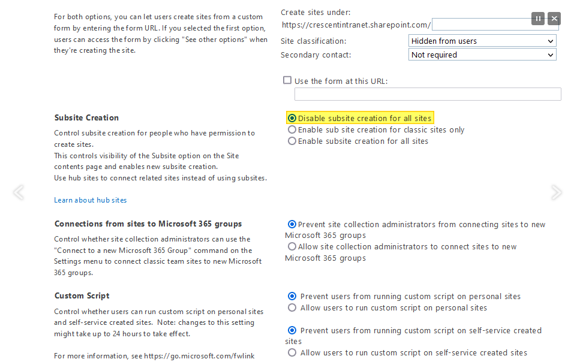
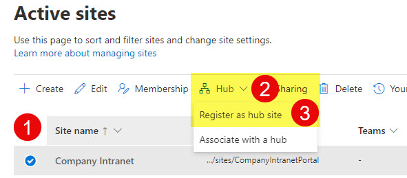
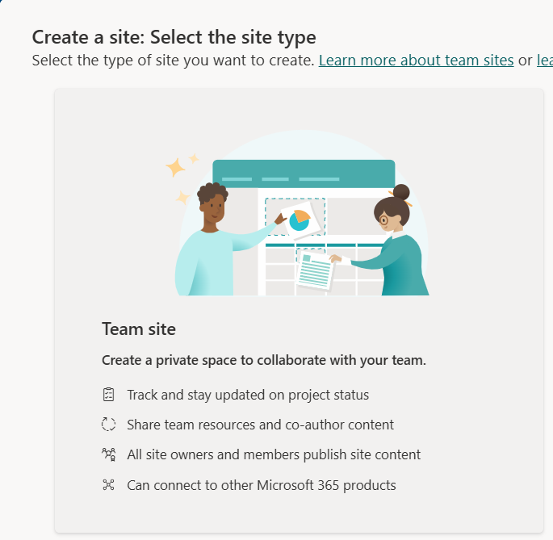
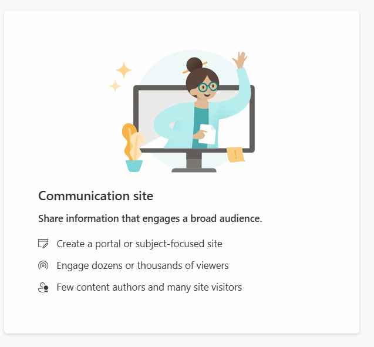
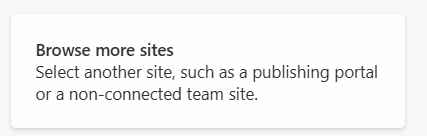
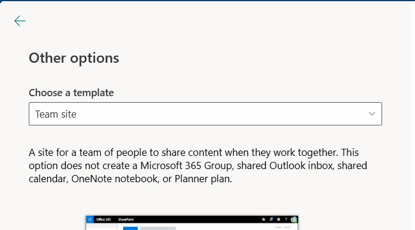

# Kapitola 03 – SharePoint Online a informační architektura

> **Bottom line.** Modern SharePoint architecture is flat, not nested: prefer separate sites joined by hubs over subsites, and know how site types and templates shape the structure.
>
> **Ve zkratce.** Moderní architektura SharePointu je plochá, ne vnořená: dávej přednost samostatným webům spojeným huby před podřízenými weby a znej, jak typy webů a šablony utvářejí strukturu.

Terminologie a struktura SharePointu, weby vs. podřízené weby, hub sites, typy webů a šablony.

## Informační architektura a terminologie

### Struktura obsahu, členění a hierarchie

SharePoint má jasnou hierarchii objektů, kterou je dobré vnímat na úrovni URL:

| URL | Objekt (EN) | Objekt (CZ) |
|---|---|---|
| `https://firma.sharepoint.com` | Tenant Top Level Site | Web nejvyšší úrovně v tenantu |
| `https://firma.sharepoint.com/sites` | Managed Path | Spravovaná cesta (jen oddělující řetězec) |
| `https://firma.sharepoint.com/sites/hr` | Site Collection / Site | Kolekce webů / web |
| `https://firma.sharepoint.com/sites/hr/benefity` | Sub-Site | Podřízený web |
| `…/sites/hr/benefity/shared documents` | Document Library | Knihovna dokumentů |
| `…/shared documents/slozka01` | Folder | Složka |
| `…/slozka01/dokument.docx` | Document | Dokument |

**Terminologie – tři názvy pro totéž:**

- **Web nejvyšší úrovně celého tenantu** = Root Tenant Site, Root Site, Root Site Collection (`https://SPOTenantURL.sharepoint.com`).
- **Web** = Site, Site Collection.
- **Podřízený web** = SubSite.

Příklad kolekce webů HR s podřízenými weby: `…/sites/hr` (kolekce) → `/benefity`, `/akce`, `/skoleni`, `/smlouvy`, `/nabor`, `/mzdy` (podřízené weby). Segment `/sites/` je jen oddělující řetězec, není potřeba ho řešit.

### Vlastnosti kolekcí webů

Následující vlastnosti jsou k dispozici na úrovni kolekce webů:

- URL adresa (`…sharepoint.com/sites/NazevSite`)
- Nastavení kvóty (kolik místa mohou data alokovat), koš
- Správce
- Úrovně oprávnění
- SharePoint skupiny
- Aktivní sady funkcí
- Metriky úložišť (využití webu a alokovaného místa)
- Scope pro omezení výsledků vyhledávání (výsledky jen z dané kolekce)
- Lokálně vytvořené číselníky spravovaných metadat (managed metadata)
- Lokálně vytvořené typy obsahů (content types)

## Weby vs. podřízené weby

Dvě možnosti struktury – **plochá (flat)** vs. **hierarchická**:

**Plochá struktura** (doporučená v moderním SharePointu):

```
https://company.sharepoint.com/sites/projects
https://company.sharepoint.com/sites/project01
https://company.sharepoint.com/sites/project02
```

**Hierarchická struktura** (weby a podřízené weby):

```
https://company.sharepoint.com/projects
https://company.sharepoint.com/projects/project01
https://company.sharepoint.com/projects/project02
```

Pro migraci webů nebo obsahu mezi weby (z webu A do B) se hodí nástroj **Sharegate**.

## Povolení tvorby podřízených webů

Ve výchozím stavu je tvorba podřízených webů v SharePoint Online omezená. Nastavení najdete v admin centru:

`https://SPOTenantURL-admin.sharepoint.com/_layouts/15/online/TenantSettings.aspx`



> **Poznámka:** následující PowerShell je z prostředí SharePoint Serveru (on-premises) a pracuje s `SPBasePermissions`. V SharePoint Online se tvorba podřízených webů řídí výše uvedeným nastavením v admin centru; skript je uveden pro úplnost / srovnání s on-premises.

```powershell
$webApp = Get-SPWebApplication -Identity https://MySharePointOnlineSiteURL
$allowSubsites = $false

$newPermissions = $null
if ($allowSubsites) {
    $newPermissions = [Microsoft.SharePoint.SPBasePermissions]($webApp.RightsMask -bor [Microsoft.SharePoint.SPBasePermissions]::ManageSubWebs)
} else {
    $newPermissions = [Microsoft.SharePoint.SPBasePermissions]($webApp.RightsMask -band [System.Int64](-bnot ([Microsoft.SharePoint.SPBasePermissions]::EmptyMask -bor [Microsoft.SharePoint.SPBasePermissions]::ManageSubWebs)))
}

$webApp.RightsMask = $newPermissions
$webApp.Update()
```

## SharePoint Online a Microsoft Teams

- **Manage who can create Microsoft 365 Groups** – řízení, kdo smí zakládat skupiny (a tím i týmy a weby).
- Integrace Microsoft Teams, SharePointu a Microsoft 365 Groups (pro IT administrátory).
- Teams tým a jeho kanály – každý tým má napojený SharePoint web.

## Koncept hub sites



Hub sites propojují související weby do jedné logické skupiny. **Co huby poskytují:**

- **Snadná navigace** – usnadňují uživatelům přechod mezi souvisejícími weby.
- **Konzistentní branding a vzhled** – jednotné vizuální styly (loga, barvy) napříč přidruženými weby.
- **Agregace obsahu** – novinky, aktivity a dokumenty z přidružených webů na centrální stránce hubu.
- **Zjednodušená správa** – přidání/odebrání webů z hubu je rychlé, bez složité konfigurace.
- **Flexibilní struktura** – dynamické přidružení webů; ideální pro reorganizace (např. změny org. struktury).
- **Zlepšení vyhledávání** – hledání obsahu napříč všemi weby připojenými k hubu.

## SharePoint Home Site

Web nejvyšší úrovně celé organizace (rozcestník / domovská stránka intranetu), s rozšířenými schopnostmi (globální navigace, vyhledávání napříč, cílení obsahu).

## Navigace

App bar a globální navigace – sjednocené navigační prvky napříč tenantem.

## Typy webů



- **Teams Team Site** – má připojenou skupinu Microsoft 365, a tedy i tým v Teams.



- **Communication Site** – nemá připojenou skupinu M365. Vhodné pro weby nejvyšší úrovně nebo kořenový web celého SPO tenantu.

- **Team Site (bez skupiny)** – nemá připojenou skupinu M365. Vhodné např. pro podřízené weby.





### Doporučení

- **Z pohledu hub sites:** hlavní web hubu = Communication Site nebo Teams Site bez týmu v Teams. Další připojené weby v hubu – použijte kterýkoli typ.
- **Z pohledu klasických webů (bez hubů):** nepotřebujete-li tým v Teams, použijte Teams site bez týmu nebo Communication site.

## Šablony webů a jejich synchronizace

Chcete-li mít „živé" vzorové weby a replikovat je do cílových míst (např. jednotné projektové weby):

```
https://firma.sharepoint.com/sites/projekty
https://firma.sharepoint.com/sites/projekty/p1
https://firma.sharepoint.com/sites/projekty/p2
```

Cesta k tomu je **PnP Provisioning Engine** – umožňuje udržovat vzorové weby a opakovaně je aplikovat na nové weby.

---

*Součást kurzu [„Microsoft SharePoint Online – administrace od A do Z"](README.md). Vede [Kamil Juřík](https://www.linkedin.com/in/kamiljurik/) · [okskoleni.cz/kurzy/detail/MSHP-ONLINE](https://www.okskoleni.cz/kurzy/detail/MSHP-ONLINE)*
