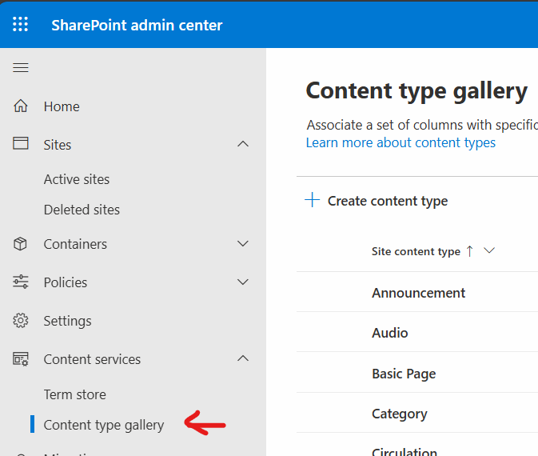
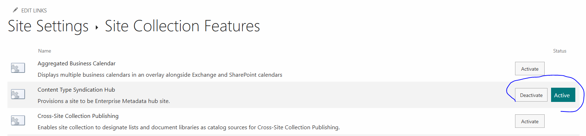
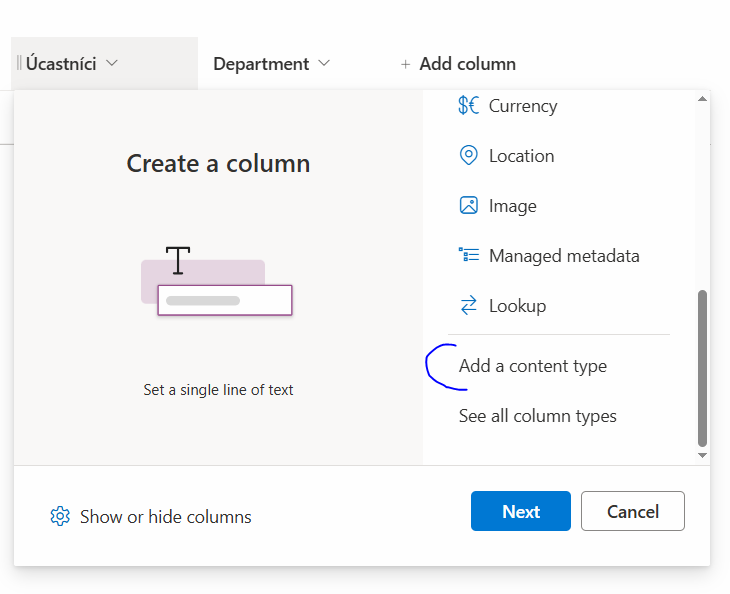
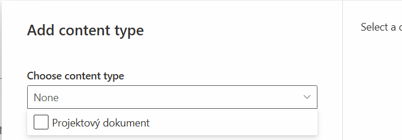
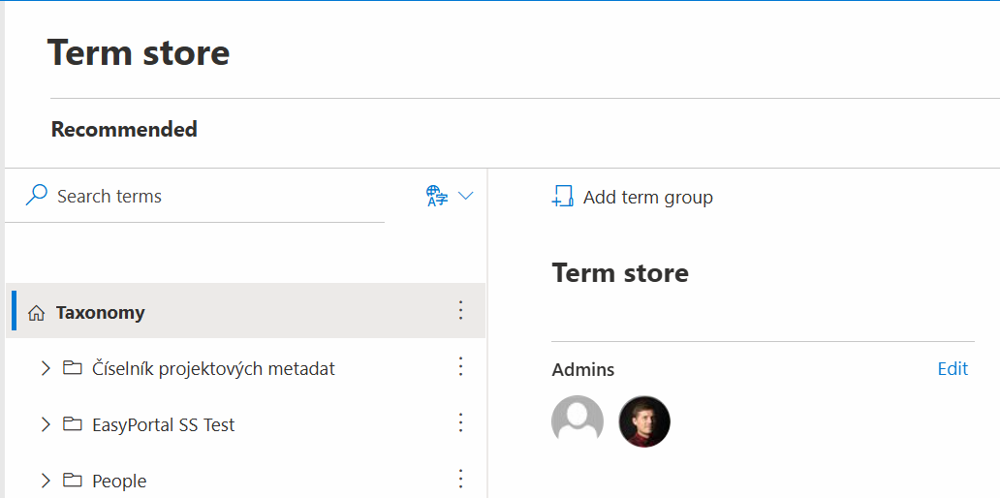
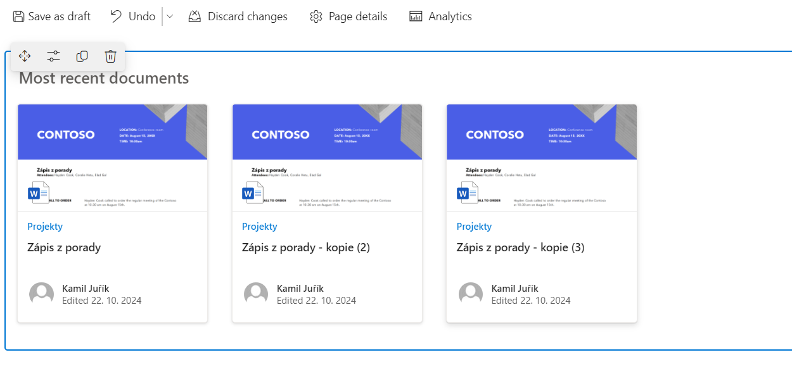

# Kapitola 04 – Správa podnikového obsahu

Enterprise Content Management v SharePoint Online: seznamy a knihovny, typy obsahů (content types), spravovaná metadata a zásady uchování.

## Seznamy a knihovny

Základ ECM tvoří **seznamy** a **knihovny dokumentů** a jejich nastavení. Nad nimi stojí typy obsahů, metadata a zásady.

## Content Types (typy obsahů)

Typ obsahu je **základní stavební kámen** celého SharePoint Online z pohledu struktury obsahu.

### Vlastnosti typu obsahu

- **Název**
- **Popis**
- **Kategorie**
- **Sloupce** (Site Columns)
- **Šablona dokumentu** (u dokumentových typů obsahu)
- **Information Management Policy Settings** (politiky zásad uchování)

### Rozsahy typů obsahů (Content Type Scopes)

**Globální typy obsahů**
- Synchronizují se na kolekce existující v tenantu **jednou za den**.
- Mají navíc oproti lokálním i **Policy Settings**.

**Lokální typy obsahů**
- Dostupné v rámci kolekce webů, kde byly vytvořeny (a na všech podřízených webech této kolekce).
- Lokální galerie typů obsahu je dostupná v rámci kolekce **ihned**: `…/_layouts/15/SiteAdmin.aspx#/contentTypes`

**Content Type Hub**
- Web hubu: `https://YourDomain.sharepoint.com/sites/ContentTypeHub`
- Správa v admin centru: `https://YourDomain-admin.sharepoint.com/_layouts/15/online/AdminHome.aspx#/contentTypes`

## Postup pro zprovoznění globálních typů obsahů

Content Type Hub se aktivuje jako funkce kolekce webů (*Content Type Syndication Hub*):

Ve sloupci knihovny pak lze přes *Add column → Add a content type* přiřadit typ obsahu:

## Služba Managed Metadata a spravovaná metadata

Spravovaná metadata (managed metadata) žijí v **Term Store** – centrální taxonomii tenantu.

### Nastavení správců Term Store

> **Důležité:** nejprve se přidejte mezi **Term Store Admins**, teprve potom můžete pracovat s termy.

### Zobrazení dokumentů dle určeného typu obsahu ve webové části

Web part *Highlighted content* umí zobrazit dokumenty filtrované mj. podle typu obsahu:

### Navigace pomocí spravovaných metadat

> **Poznámka:** metadata-driven navigace bohužel v novém UI a v nových verzích není podporována.

## Politiky zásad uchování informací

Information Management Policy Settings (zásady uchování) umožňují nastavit životní cyklus obsahu – expiraci, retenci a další pravidla nakládání se záznamy. Navazuje na Microsoft Purview (viz [kapitola 08](08-reporting.md)).

---

*Součást kurzu [„Microsoft SharePoint Online – administrace od A do Z"](README.md). Vede [Kamil Juřík](https://www.linkedin.com/in/kamiljurik/) · [okskoleni.cz/kurzy/detail/MSHP-ONLINE](https://www.okskoleni.cz/kurzy/detail/MSHP-ONLINE)*
