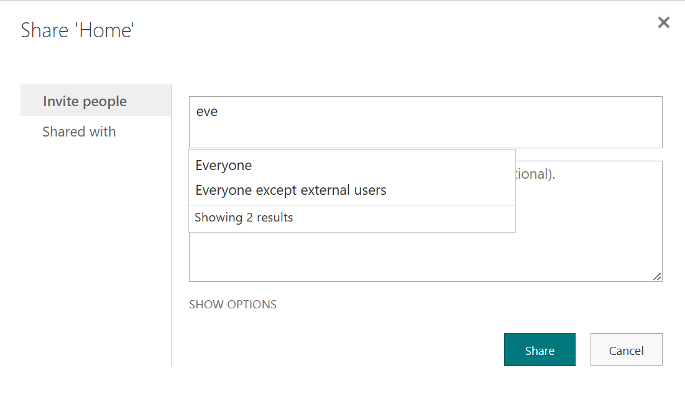
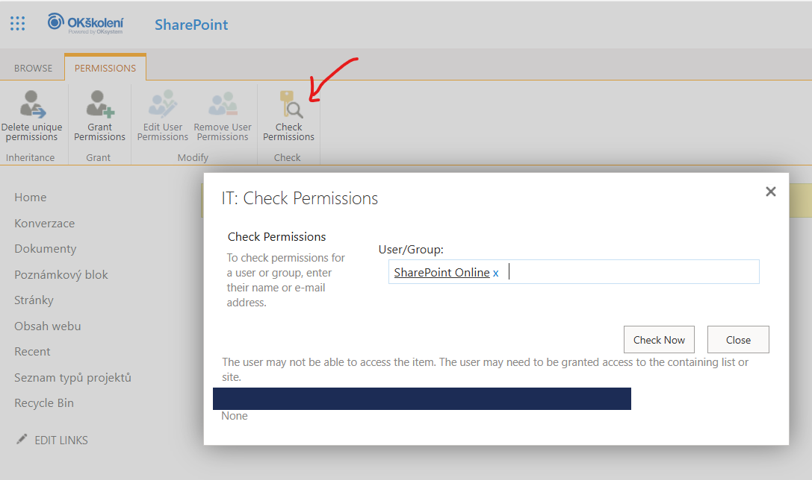
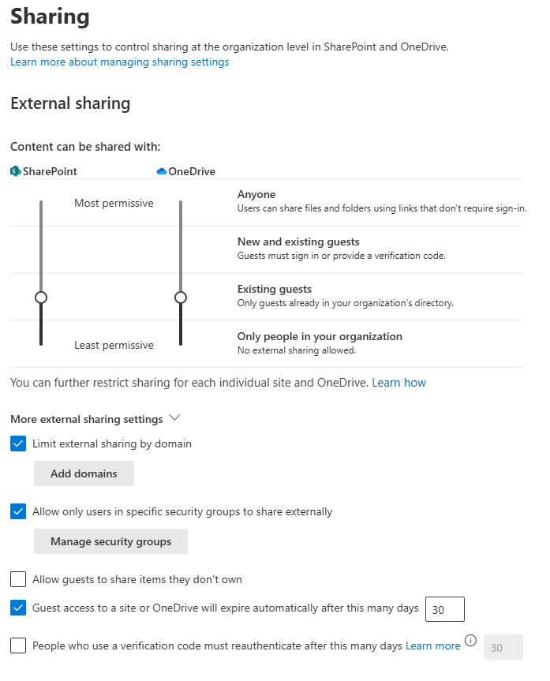

# Kapitola 05 – Řízení a správa oprávnění

Objektový model oprávnění, security scopes, SharePoint vs. Entra ID skupiny, speciální claimy (Everyone), kontrola efektivních oprávnění a zásady externího sdílení.

## Hierarchie oprávnění z pohledu objektového modelu

Oprávnění se dědí shora dolů touto hierarchií objektů:

```
tenant
  └ web (site)
      └ podřízený web (sub site)
          └ seznamy / knihovny
              └ složky
                  └ položky / dokumenty
```

## Security Scope objekty a Access Control Entries

**Security Scope** vznikne pokaždé, když jakémukoli SharePoint objektu (web, seznam/knihovna, složka, položka, dokument) nastavíte **individuální oprávnění** (přerušíte dědičnost).

- Maximální limit je **50 000** scopů na seznam/knihovnu.
- Doporučený limit je „jen" **5 000**, a raději ještě méně – cca **2 000**.

Každý Security Scope má svůj **Access Control List (ACL)** – seznam členů (Access Control Entries). ACL v SharePointu může, na rozdíl např. od NTFS, obsahovat i SharePoint Security Principal objekty:

- Entra ID user accounts
- účty jiné než Entra ID (např. guest účty)
- Active Directory / Entra ID security groups
- SharePoint groups
- Microsoft 365 skupiny

## SharePoint skupiny a úrovně oprávnění

Úroveň oprávnění = **Permission Level**. Výchozí mapování:

| SharePoint skupina | Úroveň oprávnění |
|---|---|
| Owners | Full Control |
| Members | Edit |
| Visitors | Read |

Reference: [customize site permissions](https://learn.microsoft.com/en-us/sharepoint/customize-sharepoint-site-permissions) · [understanding permission levels](https://learn.microsoft.com/en-us/sharepoint/understanding-permission-levels)

## SharePoint skupiny vs. Entra ID skupiny

| | SharePoint skupiny | Entra ID skupiny |
|---|---|---|
| **Kdo spravuje** | Správce SharePointu; vlastníci webů mohou přidávat „za běhu" | Správci IT |
| **Vnořování** | ❌ ploché, 1 úroveň na web | ✅ lze vnořovat (napodobení hierarchie firmy) |
| **Více kolekcí / systémů** | ❌ jen daná kolekce, jen SharePoint | ✅ napříč kolekcemi, weby i dalšími systémy (e-mail, notebook, disky) |
| **Viditelnost členství** | ✅ viditelné | ❌ neviditelné z SharePointu (nejste-li i Entra ID admin) |
| **Externí uživatelé** | ✅ povoleni (je-li web externě sdílen) | ❌ nepovoleni |
| **Žádosti o přístup** | ✅ ano | ❌ žádný systém žádostí |

**Shrnutí:** SharePoint skupiny dávají vlastníkům přímou kontrolu a viditelnost, ale neškálují (duplicita, žádná standardizace). Entra ID skupiny jsou dobře udržované a znovupoužitelné, ale méně transparentní pro vlastníky webů.

## Speciální „skupiny": Everyone a Everyone except external users

### Co to je z technického pohledu

Jde o **claim-based security principals**, které:

- nejsou uložené jako objekty v Entra ID,
- nemají Object ID, členy ani spravovatelnou vlastnost,
- ale systém je rozpoznává jako **virtuální skupiny**.

| Skupina | Koho zahrnuje | Typ přístupu |
|---|---|---|
| Everyone | Všechny účty v Entra ID včetně guestů (všichni členové tenantu) | Interní + externí |
| Everyone except external users | Jen interní účty (`UserType = Member`) | Pouze interní |

Claim *Everyone except external users* se vytváří **automaticky v každém M365 tenantu** a je standardně zapnutý.

### Zapnutí claimu Everyone



```powershell
Set-SPOTenant -ShowEveryoneClaim $True
```

### Vypnutí claimu Everyone except external users

```powershell
Set-SPOTenant -ShowEveryoneExceptExternalUsersClaim $False
```

## Kontrola efektivních oprávnění

Skutečně nastavená (efektivní) oprávnění ověříte funkcí **Check Permissions** na úrovni nastavení práv webu – zadáte uživatele nebo skupinu a systém ukáže, jaká oprávnění reálně má a odkud je získal.



## Správci SPO kolekcí

SharePoint Online **správci kolekcí webů (site collection admins)** mají plnou kontrolu nad danou kolekcí.

## Zásady sdílení

Externí sdílení se řídí na úrovni organizace i jednotlivých webů.

Reference: [external sharing overview](https://learn.microsoft.com/en-us/sharepoint/external-sharing-overview) · [turn external sharing on/off](https://learn.microsoft.com/en-us/sharepoint/turn-external-sharing-on-or-off) · [change external sharing per site](https://learn.microsoft.com/en-us/sharepoint/change-external-sharing-site)



**Doporučení:** zvolte úroveň **New and existing guests** nebo **Existing guests**. Obě vedou k založení Guest účtů v Entra ID:

- *New and existing guests* – guest účet vznikne bez interakce IT týmu.
- *Existing guests* – vyžaduje vytvoření pozvánky ze strany IT a její přijetí.

## SharePoint External Sharing vs. role Guest Inviter

*(v CZ: Odesílatel pozvánek pro hosty)*

| Úroveň sdílení | Co znamená | Bez Guest Inviter | S Guest Inviter |
|---|---|---|---|
| **Anyone** | Sdílení i anonymním odkazem (bez přihlášení) | ✅ může sdílet komukoli (i anonymně) | ✅ stejné (role nemá vliv) |
| **New and existing guests** | Zvát nové guesty + sdílet existujícím | ✅ může zvát nové guesty (SP to udělá) | ✅ může zvát nové guesty (i mimo SP scénáře) |
| **Existing guests** | Jen již existující guest účty | ❌ nemůže vytvořit nového guesta → sdílení selže | ✅ může vytvořit guesta → sdílení projde |
| **Only people in your organization** | Žádné externí sdílení | ❌ žádné sdílení ven | ❌ žádné sdílení ven (role bez efektu) |

**Klíčové pochopení:**

- Role **Guest Inviter** má vliv **jen na vytvoření guest účtu**.
- **SharePoint nastavení** má vliv na **samotné sdílení**.

**Kde se to láme:** u úrovně *Existing guests* – bez role sdílení nového externisty selže, s rolí projde (guest se založí v Entra ID a sdílení pak projde).

**Architektonický pohled (scénáře):**

| Scénář | Doporučené nastavení |
|---|---|
| Řízený onboarding externistů | New and existing guests |
| Uzavřený tenant s kontrolou IT | Existing guests + Guest Inviter |
| Zcela uzavřený tenant | Only people in your organization |

## Microsoft 365 a různé typy skupin

- **Skupina zabezpečení (security group)** – vytváří a spravuje se v Entra ID; použitelná na cokoli, včetně práv na SharePoint objekty (web, knihovna, složka…).
- **Microsoft 365 skupina (M365 Group)** – vzniká založením Teams týmu nebo ručně; řídí práva na úrovni Teams týmů, ale lze ji použít i na SharePoint objekty.
- **Distribuční skupina** – e-mailová skupina, typicky pro rozesílání zpráv.
- **SharePoint skupina** – existuje jen v SharePointu, nikde jinde ji nepoužijete. V jejím ACL mohou být skupiny zabezpečení i M365 skupiny.

> **Pozor:** když přiřadíte Teams týmu (potažmo kanálu) skupinu (Entra ID nebo M365), v okamžiku přiřazení dojde k **rozpadu jejích členů** a přiřazení práv jednotlivým členům – ne skupině jako celku. Následné změny členství skupiny se pak na oprávnění nemusí promítnout tak, jak byste čekali.

---

*Součást kurzu [„Microsoft SharePoint Online – administrace od A do Z"](README.md). Vede [Kamil Juřík](https://www.linkedin.com/in/kamiljurik/) · [okskoleni.cz/kurzy/detail/MSHP-ONLINE](https://www.okskoleni.cz/kurzy/detail/MSHP-ONLINE)*
