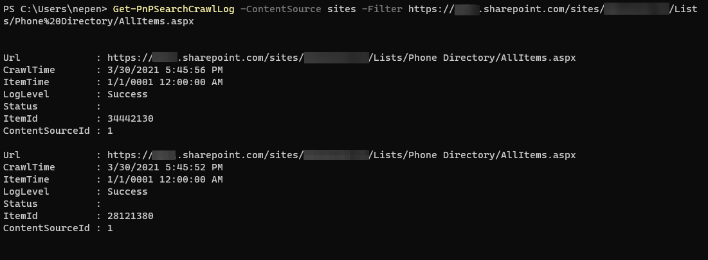
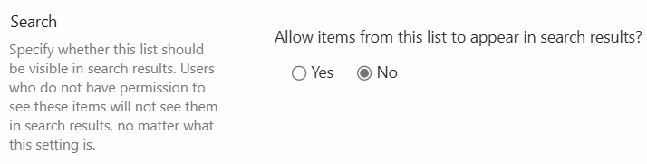

# Kapitola 06 – Vyhledávání obsahu

> **Bottom line.** How SharePoint search really works — what the crawler indexes and how fast, where results come from, enough KQL to query deliberately, and how to exclude a library from the index.
>
> **Ve zkratce.** Jak vyhledávání v SharePointu doopravdy funguje – co a jak rychle prochází crawler, odkud se berou výsledky, tolik KQL, abys dotazoval cíleně, a jak knihovnu z indexu vyřadit.

Jak SharePoint indexuje data, jak fungují vyhledávací dotazy (včetně KQL syntaxe), odkud se vrací výsledky a jak indexaci u konkrétní knihovny vypnout.

## Jak rychle SharePoint indexuje data a co to zpomaluje

O indexaci se starají dva typy crawl jobů:

- **Continuous Crawl** – průběžné procházení nového a změněného obsahu.
- **Security Only Crawl** – procházení pouze změn oprávnění.

Stav indexace zjistíte v crawl logu:

- Přehled crawl logu: `https://VášTenant-admin.sharepoint.com/_layouts/15/searchadmin/crawllogreadpermission.aspx`

```powershell
# Poslední záznamy staršího data
Get-PnPSearchCrawlLog -RowLimit 10 -EndDate (Get-Date).AddDays(-30)

# Jen selhané položky
Get-PnPSearchCrawlLog | Where-Object { $_.Status -eq "Failed" } |
  Format-Table -Property Date, Status, ErrorDetails

# Filtrovat podle zdroje / cesty
Get-PnPSearchCrawlLog -ContentSource sites -Filter "https://…sharepoint.com/sites/…/Lists/"
```



**Chybějící data ve výsledcích vyhledávání** ([dokumentace](https://learn.microsoft.com/en-gb/sharepoint/troubleshoot/search/search-results-missing)):

- Web: *Site settings → Search and Offline Availability*
- Knihovna: *Library Settings → Advanced Settings*

## Jak fungují vyhledávací dotazy

Když napíšete text do vyhledávacího pole, SharePoint prohledává:

- **Název souboru / položky**
- **Název složky**
- **Obsah dokumentu / položky**
- **Všechny sloupce / metadata** – pokud jsou indexované

Pokročilé hledání využívá **operátory** ([reference](https://learn.microsoft.com/en-us/previous-versions/office/developer/sharepoint-2010/ee872310(v=office.14))) a **managed / crawled properties** ([reference](https://learn.microsoft.com/en-us/sharepoint/crawled-and-managed-properties-overview)).

### Syntaxe dotazů

| Co chcete vyhledat | Syntaxe | Popis |
|---|---|---|
| Jen podle obsahu dokumentu | `body:váštext` | Obsah uvnitř souborů |
| Jen podle názvu dokumentu | `filename:váštext` | Názvy souborů |
| Zástupný znak (jen na konci) | `váste*` | Funguje jen na konci slova |
| Dokumenty větší než velikost | `size>1000000` | V bajtech (1 MB = 1 000 000 B) |
| Kombinace velikosti a typu | `size>1000000 AND filetype:pdf` | Např. velké PDF |
| Podle typu obsahu | `SPContentType:váštext` / `ContentType:váštext` | Content typy v knihovně |
| Podle typu souboru | `filetype:docx` | Např. Word dokumenty |
| Podle autora | `author:"Jan Novák"` | Celé jméno v uvozovkách |
| Podle editora | `editor:"Petr Svoboda"` | Kdo naposledy editoval |
| Vytvořené po datu | `created>2024-01-01` | Formát RRRR-MM-DD |
| Upravené v rozsahu | `modified>=2024-01-01 AND modified<=2024-12-31` | Rozsah dat |
| Z konkrétní knihovny | `path:"https://firma.sharepoint.com/sites/HR/Dokumenty"` | Přesná URL |
| S konkrétními metadaty | `Kategorie:Smlouvy` | Sloupec Kategorie = Smlouvy |
| Vyloučit typ souboru | `-filetype:pdf` | Vylučovací operátor |
| Podle názvu seznamu | `ListTitle:"Faktury"` | Název seznamu/knihovny |
| Fráze ve více formátech | `"smlouva" AND (filetype:pdf OR filetype:docx OR filetype:xlsx)` | Fráze + více typů |
| Číselný sloupec | `CenaOWSNMBR>1000` | Vlastní číselné sloupce |
| Boolean – schváleno | `SchvalenoOWSBOOL:1` | Boolean hodnoty |
| Boolean – nearchivováno | `ArchivOWSBOOL:0` | Boolean hodnoty |
| Choice pole | `StavOWSCHCS:"Dokončeno"` | Výběr ze seznamu |
| Datum v metadatech | `DatumOdeslaniOWSDATE>2024-03-01` | Sloupec typu datum |
| Slovo1 ale ne slovo2 | `slovo1 -slovo2` | Vylučující kombinace |
| Klíčová slova | `keywords:"projekt A"` | Jsou-li keywords indexovány |
| Jen dokumenty | `IsDocument:True` | Vrátí jen dokumenty |

> **Pozn. k příponám sloupců:** `OWSNMBR` (číslo), `OWSBOOL` (ano/ne), `OWSCHCS` (choice), `OWSDATE` (datum) jsou automaticky generované managed properties z názvu interního sloupce.

### Příklad složeného dotazu

```
ContentType:"Zápis z porady" AND Editor:"Jan Novák" AND Size>=102400 AND FileType:docx
```

## Odkud se mi vrací data

Výsledky jsou **security-trimmed** – uvidíte jen obsah, ke kterému máte oprávnění. Zdrojem je vyhledávací index (Modern Search) napříč weby v tenantu.

## Volitelně: hybrid Search se SharePoint Serverem (on-premises)

V hybridních scénářích lze index propojit s on-premises SharePointem, takže výsledky obsahují obsah z cloudu i z lokálního prostředí.

## Jak zabránit indexaci dat u seznamu / knihovny

V nastavení knihovny/seznamu → *Advanced Settings* → *Allow items from this list to appear in search results?* → **No**.



> Pozor: skrytí z vyhledávání **není bezpečnostní hranice** – kdo nemá oprávnění, obsah stejně neuvidí; kdo oprávnění má, dostane se k němu i přímým odkazem. Citlivá data chraňte oprávněními, ne jen vypnutím indexace.

---

*Součást kurzu [„Microsoft SharePoint Online – administrace od A do Z"](README.md). Vede [Kamil Juřík](https://www.linkedin.com/in/kamiljurik/) · [okskoleni.cz/kurzy/detail/MSHP-ONLINE](https://www.okskoleni.cz/kurzy/detail/MSHP-ONLINE)*
