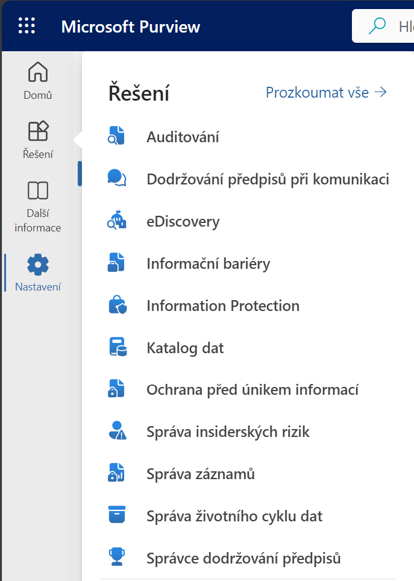
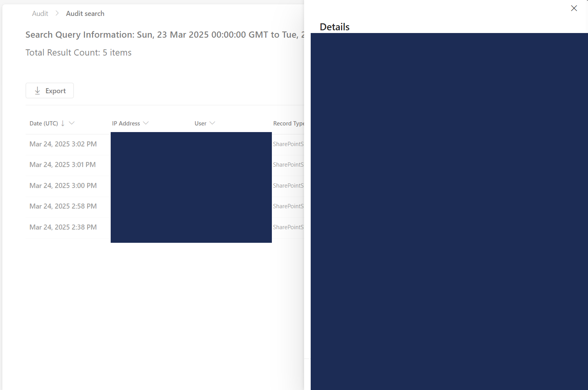
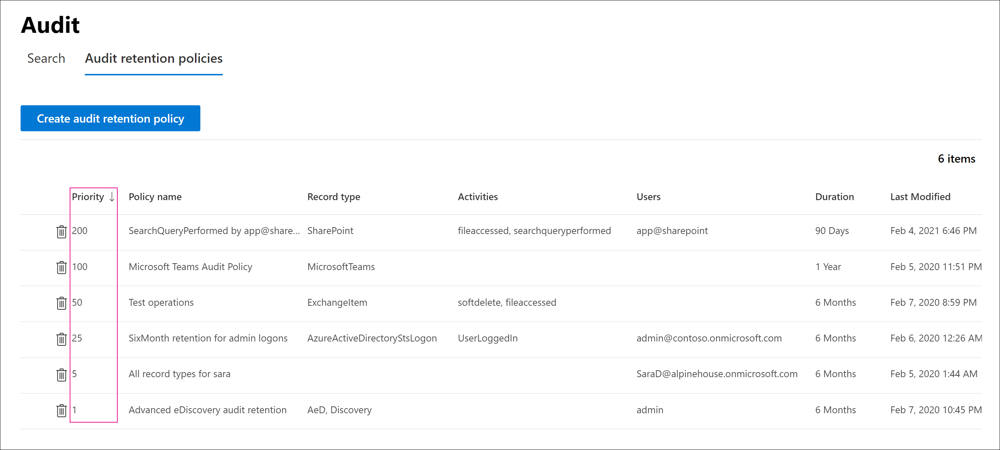

# Kapitola 08 – SharePoint reporting

Přehled toho, kde správce SharePoint Online najde provozní a bezpečnostní data: reporty v Microsoft 365 Admin Center, přehledy využití webů, auditní stopu v Microsoft Purview a zásady upozornění.

## Reporting v Microsoft 365 Admin Center

Základní reporty o aktivitě SharePointu jsou součástí Microsoft 365 Admin Center:

- **Microsoft 365 Reports in the admin center – SharePoint activity**
- Dostupné na <https://admin.cloud.microsoft/#/reportsUsage>

Reporty pokrývají aktivitu uživatelů, počet aktivních webů, objem uložených dat a využití úložiště.

## Přehledy využití webů

Každý web má vlastní stránku **Usage** (Nastavení webu → Využití webu), kde vlastník nebo správce vidí návštěvnost, nejčtenější obsah, oblíbené soubory a trend za posledních 90 dní.

## Microsoft Purview – auditování

Microsoft Purview je platforma pro auditování, správu záznamů a životního cyklu dat.

- Přehled: <https://www.microsoft.com/cs-cz/security/business/microsoft-purview>
- Portál: <https://purview.microsoft.com/>



### Kdy funguje audit log

Auditování v Microsoftu 365 je dostupné ve výchozím stavu, ale je potřeba počítat s tím, že:

- **Audit log musí být zapnutý.** Někdy je aktivní ve výchozím nastavení, jindy je nutné ho zapnout ručně.
- Data se ukládají do **Unified Audit Logu**, ke kterému se přistupuje přes Microsoft Purview → Audit, případně přes PowerShell nebo Microsoft Graph.

Zapnutí uchovávání audit logu ([dokumentace](https://learn.microsoft.com/en-us/purview/audit-log-enable-disable?tabs=microsoft-purview-portal)):

```powershell
Set-AdminAuditLogConfig -UnifiedAuditLogIngestionEnabled $true
```

### Zásady uchování (Retention policies)

Politiky určují, jak dlouho se auditní data uchovávají. Bez vlastní politiky nevidíte záznamy starší než **180 dní**.

- Dokumentace: [audit-log-retention-policies](https://learn.microsoft.com/cs-cz/purview/audit-log-retention-policies?tabs=microsoft-purview-portal)
- **Priority** politiky určuje pořadí zpracování – nižší hodnota znamená vyšší prioritu.
- Pro uchování **nad 180 dní** je potřeba licence **E5** pro uživatele, který výpis z audit logu generuje.

### Search

Vyhledávání v datech audit logu – buď v portálu Purview, nebo přes PowerShell (viz níže). Výsledek hledání zobrazí jednotlivé události s časem, uživatelem, IP adresou a typem záznamu; detail události ukazuje mimo jiné dotčený web, cílového uživatele a měněné vlastnosti.



### Purview a licence

**Co je dostupné v základu** (většina plánů M365 jako E1, E3, Business Standard):

- Záznamy o přihlašování uživatelů, sdílení dokumentů, úpravách souborů v OneDrive/SharePointu, čtení mailů v Exchange a vyhledávání v Microsoft Search.
- Uchovávání logů **180 dní** (dříve 90, Microsoft rozšířil).

**Pokročilé auditování (Microsoft Purview Audit Premium)** – dostupné v licencích M365 E5, E5 Compliance nebo jako samostatný add-on. Přináší:

- uchovávání logů **až 1 rok** (až 10 let s nastavením long-term retention),
- rozšířené typy událostí (např. přístup ke zprávám, `MailItemsAccessed`, vysokofrekvenční události).

| Funkce | Business Standard / E1 / E3 | E5 / Audit Premium |
|---|---|---|
| Audit přístupů a aktivit | ano | ano |
| Doba uchování | 180 dní | 1 rok až 10 let |
| Pokročilé typy událostí | ne | ano |
| `MailItemsAccessed` logy | ne | ano |
| Vysokofrekvenční události | ne | ano |

### Jak vyfiltrovat změny správců webů (site collection adminů)

Přihlášení k Exchange Online / Compliance centru:

```powershell
Connect-ExchangeOnline
```

Vyhledání změn správců webů v daném období:

```powershell
Search-UnifiedAuditLog -StartDate "2025-03-01" -EndDate "2025-03-24" `
  -Operations SiteAdminAdded,SiteAdminRemoved `
  -RecordType SharePoint `
  -ResultSize 5000
```

Export do CSV:

```powershell
Search-UnifiedAuditLog -StartDate "2025-03-01" -EndDate "2025-03-24" `
  -Operations SiteAdminAdded,SiteAdminRemoved `
  -RecordType SharePoint `
  -ResultSize 5000 |
  Export-Csv -Path "SharePoint_AdminChanges.csv" -NoTypeInformation -Encoding UTF8
```

### Přehled vybraných SharePoint událostí v audit logu

Sloupce BS/E3 a E5 udávají, zda je událost dostupná v základní, resp. Premium licenci.

**Souborové operace**

| Operation (interní název) | Název v UI | Popis | BS/E3 | E5 |
|---|---|---|:---:|:---:|
| FileAccessed | Viewed file | Soubor otevřen (čtení/náhled) | ano | ano |
| FileDownloaded | Downloaded file | Soubor stažen | ne | ano |
| FileModified | Modified file | Soubor upraven | ano | ano |
| FileDeleted | Deleted file | Soubor smazán | ano | ano |
| FileUploaded | Uploaded file | Soubor nahrán | ano | ano |
| FileRenamed | Renamed file | Soubor přejmenován | ano | ano |
| FileMoved | Moved file | Soubor přesunut | ano | ano |
| CheckedOutFile | Checked out file | Check-out souboru | ano | ano |
| CheckedInFile | Checked in file | Check-in souboru | ano | ano |
| RecycleBinDeleted | Deleted item from recycle bin | Trvalé smazání z koše | ano | ano |
| RecycleBinRestored | Restored item from recycle bin | Obnova z koše | ano | ano |

**Sdílení a oprávnění**

| Operation | Název v UI | Popis | BS/E3 | E5 |
|---|---|---|:---:|:---:|
| SharingSet | Shared file or folder | Nastavení sdílení dokumentu | ano | ano |
| SharingInvitationCreated | Created sharing invitation | Vytvoření pozvánky ke sdílení | ano | ano |
| AnonymousLinkCreated | Created anonymous link | Vytvoření anonymního odkazu | ano | ano |
| AccessRequestSubmitted | Submitted access request | Žádost o přístup | ano | ano |
| PermissionChange | Changed permission | Změna oprávnění | ano | ano |

**Weby a kolekce**

| Operation | Název v UI | Popis | BS/E3 | E5 |
|---|---|---|:---:|:---:|
| SiteCollectionCreated | Created site collection | Vytvoření kolekce webů | ano | ano |
| SiteCreated | Created site | Vytvoření podřízeného webu | ano | ano |
| SiteDeleted | Deleted site | Smazání webu | ano | ano |
| SiteRenamed | Renamed site | Přejmenování webu | ano | ano |
| SiteAdminAdded | Added site collection admin | Přidání správce webu | ano | ano |
| SiteAdminRemoved | Removed site collection admin | Odebrání správce webu | ano | ano |
| SitePermissionChanged | Changed site permission | Změna oprávnění webu | ano | ano |
| GroupSiteConnected | Connected site to group | Propojení s Microsoft 365 Group | ano | ano |
| SiteDesignApplied | Applied site design | Použití Site Designu | ano | ano |

**Citlivost a uchovávání**

| Operation | Název v UI | Popis | BS/E3 | E5 |
|---|---|---|:---:|:---:|
| SensitivityLabelApplied | Applied sensitivity label to file | Štítek citlivosti na soubor | ano | ano |
| SiteSensitivityLabelApplied | Applied sensitivity label to site | Štítek citlivosti na celý web | ano | ano |
| RetentionLabelPublishedToSite | Published retention label to site | Publikace retention štítku | ano | ano |

**Compliance / Premium**

| Operation | Název v UI | Popis | BS/E3 | E5 |
|---|---|---|:---:|:---:|
| HighFrequencyAccessedFile | Accessed file (high frequency) | Vysokofrekvenční přístup k souboru | ne | ano |
| eDiscoveryAccessedContent | Accessed content via eDiscovery | Přístup přes eDiscovery | ne | ano |
| ExtendedRetentionEnabled | Extended audit retention | Uchování logů až 10 let | ne | ano |

### Jak aktivovat Audit Premium – krok za krokem

1. **Ověř licenci.** Audit Premium je dostupný s M365 E5, E5 Compliance nebo add-onem Microsoft Purview Audit (Premium). Ověříš v Microsoft 365 admin centru → Billing → Licenses.
2. **Přejdi do portálu Purview Audit** (<https://purview.microsoft.com/> → Audit).
3. **Rozšířené auditování se zapíná automaticky**, jakmile máš správnou licenci a použiješ některou premium funkci (dotaz na `MailItemsAccessed`, záznam `FileDownloaded`, vysokofrekvenční aktivita). Hlavní vědomá akce je nastavení dlouhodobého uchovávání.
4. **Aktivace 10letého uchovávání audit logů:** v levém menu *Audit retention policies* → *+ Create policy* → zadej název (např. „10letý audit SharePointu"), vyber aktivitu/uživatele, nastav *Retention duration: 10 years* a potvrď *Submit*.

   
5. **Ověření:** spusť auditní hledání např. pro `FileDownloaded`, `MailItemsAccessed` nebo `eDiscoveryViewedItem`. Pokud dostaneš výsledky, Audit Premium běží.

## Zásady upozornění (Alert policies)

Automatická upozornění na definované události (např. hromadné stahování, změny oprávnění) se konfigurují v Microsoft 365 Defender portálu: <https://security.microsoft.com/alertpoliciesv2>

---

*Součást kurzu [„Microsoft SharePoint Online – administrace od A do Z"](README.md). Vede [Kamil Juřík](https://www.linkedin.com/in/kamiljurik/) · [okskoleni.cz/kurzy/detail/MSHP-ONLINE](https://www.okskoleni.cz/kurzy/detail/MSHP-ONLINE)*
